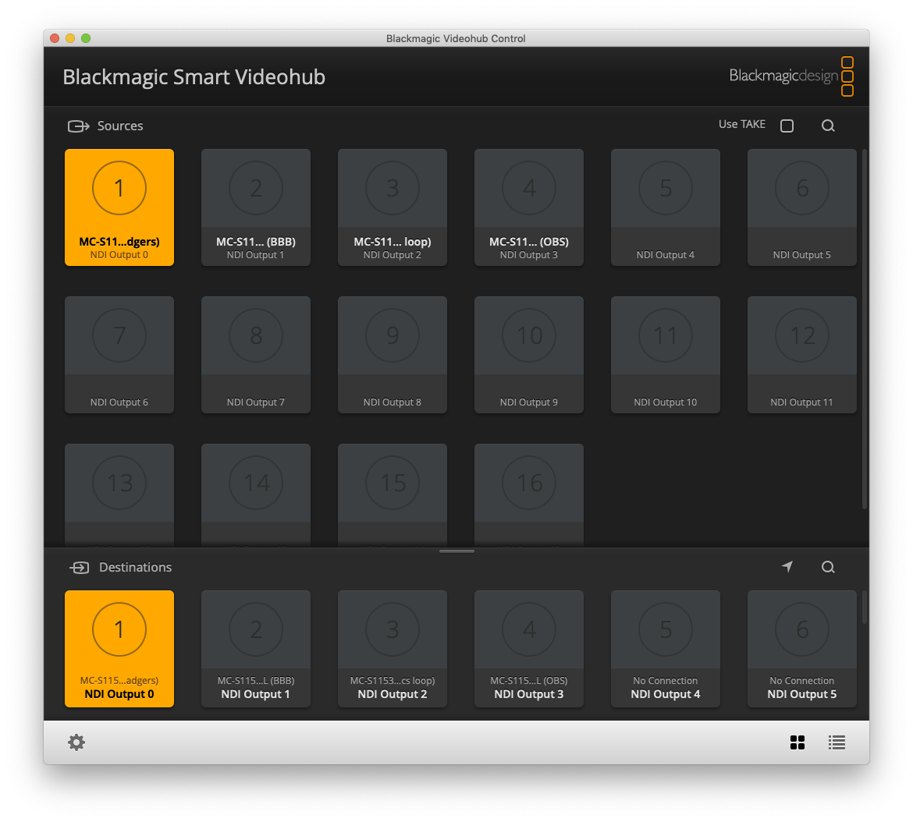

# NDI Router
This is a work in progress to create an NDI router. The basic idea is a fixed amount of outputs is created that can be used by NDI receivers. This software can then route sources on the netowkr into one of those fixed outputs. Much like a physical hardware video router.

To help in the ease of control rather than ship with a custom UI this has been built this to use the same protocol used by blackmagic to control their hardware based video routers. You can download a copy of Videohub control from [Black Magic](https://www.blackmagicdesign.com/uk/support/family/routing-and-distribution).



This is written in in rust so the following commands can be used to compile and run. It will require the NDI libs to be somewhere on the PATH.

```bash
cargo build
cargo run
```

### Usage
The plan will be to use the Blackmagic videohub ethernet protocol as a way of setting routes.
The format of the protocol is text commands over TCP.
The attached documentation lists the protocol spec (pg 77). 

The server can be accessed at `127.0.0.1:9990`.

## TODO
- [x] Fetch NDI sources on network
- [X] Create TCP server to control
- [X] Using NDI routing API to foreward sources
- [X] Make compatible with BMD videohub spec
- [X] Handle Multiple clients
- [ ] Handle output locking
